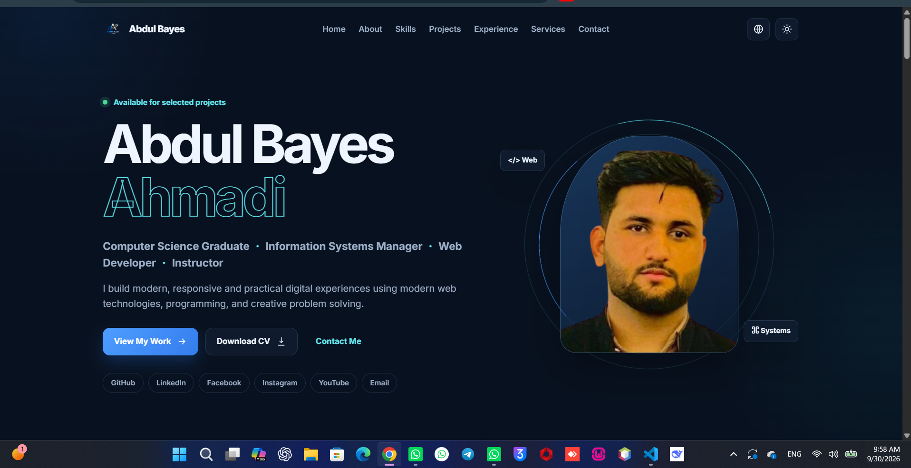
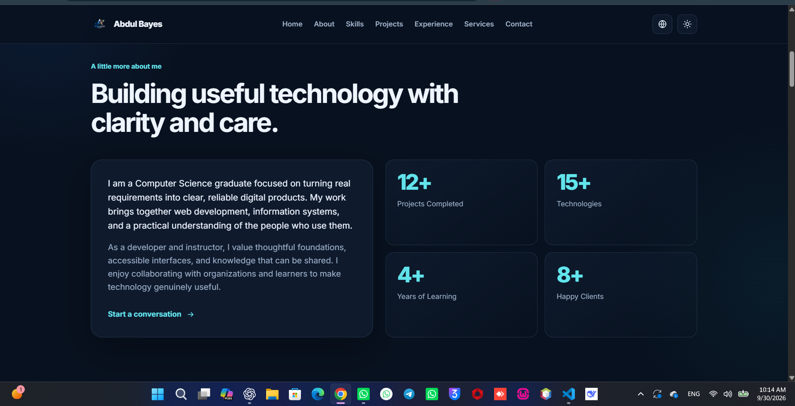
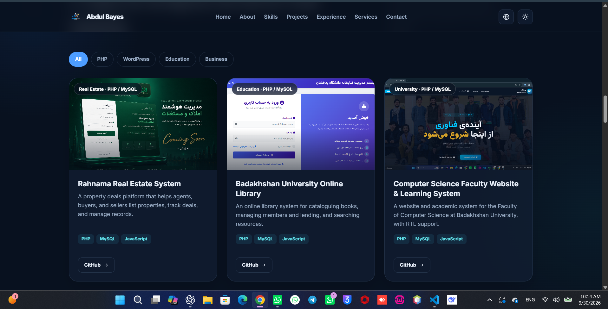

# Abdul Bayes Ahmadi — Personal Portfolio

A modern, professional, multilingual personal portfolio website for **Abdul Bayes Ahmadi** — Computer Science Graduate, Information Systems Manager, Web Developer, and Instructor.

🔗 **Live Demo:** [Open Live Demo](https://bayesahmadi.github.io/Bayes-Profile/)

---

## Preview







---

## About the Project

This portfolio website presents Abdul Bayes Ahmadi’s professional background, skills, services, experience, and web development projects in a premium and responsive design.

The website is designed for employers, freelance clients, companies, universities, and international opportunities.

---

## Features

- Modern, premium, and professional design
- Fully responsive layout for desktop, laptop, tablet, and mobile
- Three-language support:
  - English
  - Dari / Persian
  - Pashto
- Full RTL support for Dari and Pashto
- LTR support for English
- Language preference saved with `localStorage`
- Dark mode and light mode
- Theme preference saved with `localStorage`
- Sticky responsive navigation bar
- Animated mobile hamburger menu
- Smooth scrolling and subtle animations
- Glassmorphism cards and gradient effects
- Animated project filtering
- Animated statistics section
- Professional project showcase
- Skills and technologies section
- Experience and education timeline
- Services section
- Downloadable CV section
- Contact form with email support
- SEO-friendly metadata
- Open Graph metadata
- JSON-LD structured data for professional profile SEO
- Accessible semantic HTML structure
- Lightweight implementation without unnecessary libraries

---

## Sections

The portfolio includes the following sections:

1. **Home / Hero**
   - Professional introduction
   - Job roles
   - Social links
   - Call-to-action buttons

2. **About Me**
   - Background in Computer Science
   - Web development and information systems experience
   - Teaching and instructor profile
   - Animated statistics

3. **Skills**
   - Frontend development
   - Backend development
   - Tools and platforms
   - Desktop application development

4. **Projects**
   - Faculty of Computer Science Website
   - Barakat Al Sai Website
   - Personal and other web projects
   - Project filters

5. **Experience & Education**
   - Computer Science education
   - Web development experience
   - Information systems work
   - Teaching experience
   - Freelance projects

6. **Services**
   - Website Development
   - Responsive Web Design
   - PHP & MySQL Development
   - React Development
   - WordPress & Elementor
   - Business Website Development
   - Website Maintenance
   - Technical Consulting

7. **Resume / CV**
   - Education
   - Skills
   - Experience
   - Certifications
   - Languages
   - CV download button

8. **Contact**
   - Contact form
   - Email
   - GitHub
   - LinkedIn
   - Location: Afghanistan

---

## Technologies Used

- HTML5
- CSS3
- JavaScript
- LocalStorage
- Google Fonts
- JSON-LD Structured Data
- Responsive CSS Grid and Flexbox
- CSS Animations and Transitions

---

## Project Structure

```text
portfolio-website/
├── index.html
├── styles.css
├── app.js
├── README.md
├── images/
│   ├── demo.png
│   ├── da.png
│   └── jd.png
└── assets/
    └── Abdul-Bayes-Ahmadi-CV.pdf
```

---

## Getting Started

### 1. Clone the repository

```bash
git clone https://github.com/bayesahmadi/Bayes-Profile.git
```

### 2. Open the project folder

```bash
cd Bayes-Profile
```

### 3. Run the website

Open `index.html` in your web browser.

For a better local development experience, use the **Live Server** extension in Visual Studio Code.

---

## Customization Guide

Before publishing or sharing the portfolio, update the following information:

### Personal Information

Update your name, title, professional introduction, and location in:

```text
index.html
app.js
```

### Contact Information

Replace the placeholder email address in `app.js`:

```js
const CONTACT_EMAIL = 'bayes.ahmadi0@gmail.com';
```

### Social Media Links

Update your GitHub and LinkedIn URLs in:

```text
index.html
app.js
```

### Profile Image

Replace the profile image area with your professional image.

### Projects

Add or edit projects in `app.js`, including:

- Project title
- Description
- Technologies
- GitHub link
- Live demo link
- Category

### CV

Replace the CV file inside the `assets` folder:

```text
assets/Abdul-Bayes-Ahmadi-CV.pdf
```

---

## Languages and Direction

| Language | Code | Layout Direction |
|---|---|---|
| English | `en` | LTR |
| Dari / Persian | `fa` | RTL |
| Pashto | `ps` | RTL |

The website automatically changes its layout direction when Dari or Pashto is selected.

---

## Deployment

This project can be deployed using:

- [GitHub Pages](https://pages.github.com/)
- [Netlify](https://www.netlify.com/)
- [Vercel](https://vercel.com/)
- [Cloudflare Pages](https://pages.cloudflare.com/)
- Standard cPanel hosting

Current deployment:

[https://bayesahmadi.github.io/Bayes-Profile/](https://bayesahmadi.github.io/Bayes-Profile/)

---

## SEO Features

- Optimized page title
- Meta description
- Open Graph metadata
- Twitter card metadata
- Semantic headings
- Descriptive image alt text
- JSON-LD Person schema
- Mobile-friendly responsive design
- Lightweight code for faster loading

---

## Author

**Abdul Bayes Ahmadi**

- Computer Science Graduate
- Information Systems Manager
- Web Developer
- Instructor

---

## License

This project is created for personal and professional portfolio use. You may customize it for your own portfolio, but please give appropriate credit if you reuse the original structure or design.

---

Built with purpose by **Abdul Bayes Ahmadi**.